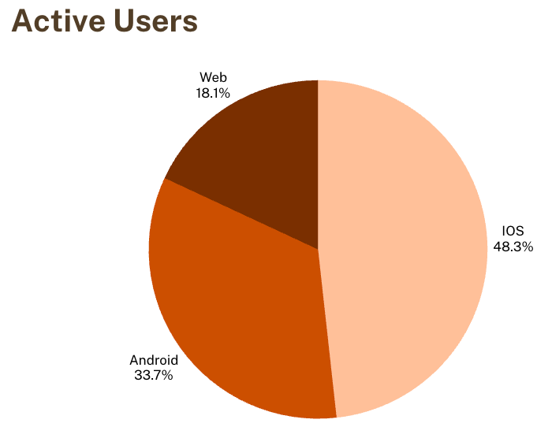
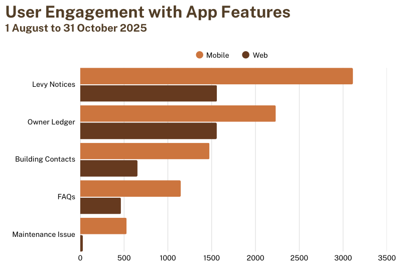
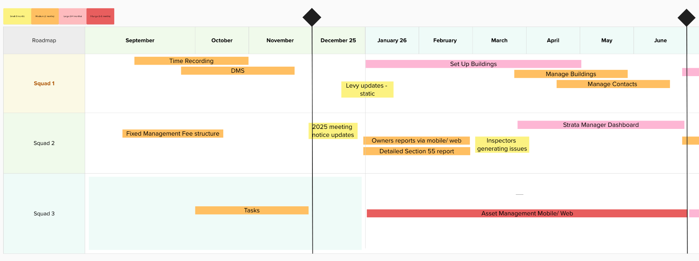
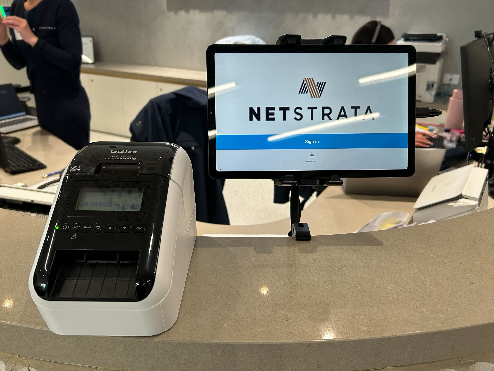
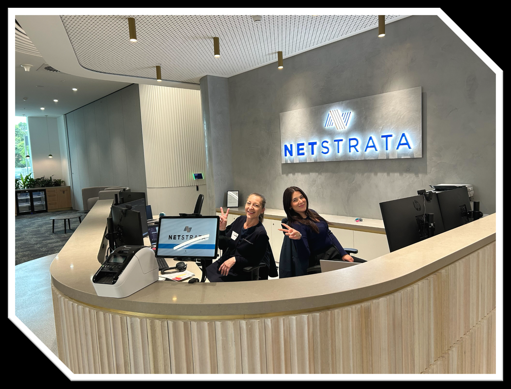
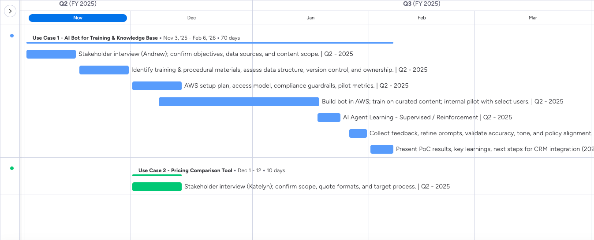

# 11 SS, IT & SMP Tom

**Source:** `11 SS, IT & SMP Tom.pdf`
**Converted:** 2025-12-01 01:44:00
**Pages:** 17
**Creator:** Nitro PDF Pro 14 (14.3.1.193)

---

## Page 1

Page 84

STRATA SPACE, IT AND SMP

QUARTERLY BOARD UPDATE
JUL - SEPT 2025

PREPARED FOR: TED MIDDLETON, STEPHEN BRELL & EXECS
PREPARED BY: TOM BACANI
NOV 2025

Page 1

---

## Page 2

Page 85

STRATA SPACE
 EXECUTIVE SUMMARY

The General Communications module is now largely delivered, giving our admin teams a
faster, more polished way to communicate and presenting clients with professional,
brand-consistent emails. Built-in automation handles salutations, unique links, and
embedded images, small touches that make a big impact. Strata Managers now have a
reliable, all-in-one tool for building-wide messaging, letting them reach owners and
residents by email, SMS, and in-app notification in one go.

We also implemented the new management fee structure, a significant milestone that
gives us the flexibility to tailor charges and models to each scheme’s needs. It’s the
framework we needed to set up scalable and adaptable pricing going forward.

After a slow start, recruitment has surged, eight hires in under two months. At one point, I
doubted we’d pull it off, but patience paid off. The influx has brought fresh energy and the
opportunity to accelerate our roadmap.

Top 3 Wins

   •     Management fee structure – implemented and set to prove its value in flexibility and
         simplicity.
   •     General Communications module – delivered and already in daily use across the
         business.
   •     Updates to arrears process to comply with Legislation – dashboards, process
         updates and system tweaks in both Strata Space and MYOB.

Top 3 Risks / Challenges

   •     Rapid onboarding at scale. We’ve brought in many new faces quickly, so getting
         them up to speed fast is critical. We’ve rolled out a structured onboarding program
         involving the whole team, leads and seniors are running intensive knowledge-
         transfer and shadowing sessions to compress the learning curve.
   •     Team structure evolution. To maintain focus and pace, we’re reshaping Strata
         Space into smaller, purpose-built squads. This will help us deliver faster while
         keeping accountability tight.
   •     Financials simplification. Execution is further out, but we’ve identified a viable path
         for simplifying MYOB’s financial screens, work that will improve internal efficiency
         and lay the groundwork for future commercialisation.

Page 2

---

## Page 3

Page 86

While I miss Brett’s counsel, Hong has stepped up confidently, bringing his own leadership
style, and Giggs has picked up much of Brett’s left over accounting integration work. The
team’s willingness to stretch and share expertise gives me confidence that Strata Space’s
technical depth is broader and stronger.

Looking Ahead (next 8–12 weeks)

   •     Meeting notice updates – improve the look and feel of our agendas.
   •     December deployment of DMS, Tasks, and Time Recording – a major step forward;
         we’ll provide heightened support to ensure a smooth transition.
   •     Draft designs for Buildings and Asset Management modules – complete and ready,
         setting us up to begin development on these significant next-phase features.

 STRATA SPACE TEAM

This quarter marks a structural shift for the Strata Space team. We’re moving away from a
monolithic model to a squad-based structure - smaller, mission-aligned teams with end-
to-end accountability. The goal is simple: flow, quality, and reliability. Work should move
faster with fewer hand-offs, ownership should be tighter, and surprises fewer. It’s a tried
and tested delivery model, and it suits the scale and maturity Strata Space has reached.

To support this change, I’ve created new lead roles within the team. These aren’t major
remuneration changes but rather growth opportunities for key people to learn, refine, and
stretch their leadership skills. I’m working closely with them through coaching and
mentoring, and to their credit, they’ve embraced it. They see the value in earning the role
they want. That mindset alone gives me confidence this transition will succeed.

With eight new hires joining in quick succession, onboarding has been one of our biggest
short-term challenges. We’ve built a structured onboarding and knowledge-transfer
program, with senior and lead engineers taking a hands-on role to bring newcomers up to
speed quickly. It’s a heavy lift in the short term but essential to maintain quality and
momentum.

While we’ve expanded quickly, I’ve made sure the contractual framework for new hires,
especially offshore - preserves flexibility, including the ability to scale down if required.

The team’s morale is strong, and for the first time in a while, there are no active
performance watch-points. Jedrick, who had been under close review earlier in the year,
has lifted markedly and is now performing in line with peers.

Page 3

---

## Page 4

Page 87

30–60 Day Focus

   •     Successfully transition to the new squad structure and embed clear lines of
         ownership.
   •     Maintain our open, honest, and helpful culture, foster strong cross-squad
         collaboration through regular catch-ups and shared engineering and quality
         standards.
   •     Continue the onboarding and integration of new hires, ensuring they’re confident
         and productive by year-end.
   •     Ensure the team is fully prepared to support the December release of DMS, Tasks,
         and Time Recording, with capacity ring-fenced for post-launch support.

 ACCOUNTING UPDATES

All schemes have now completed a full year of reporting via Strata Space, marking a
significant milestone in the system’s maturity and reliability. The platform now consistently
delivers auditable financial data and is fully embedded in our operational processes.
Notably, the finance team received favourable reviews from our two new auditors, who
commended the quality of our reports and underlying business processes.

All schemes have now completed a full year of reporting via Strata Space, marking a
significant milestone in the system’s maturity and reliability. The platform now consistently
delivers auditable financial data and is fully embedded in our operational processes.
Notably, the finance team received favourable reviews from our two new auditors,
feedback that was shared publicly via Google reviews, commending the quality of our
reports and underlying business processes.

The most impactful advancement this quarter was the implementation of the new
management fee schedule, with dedicated resources ensuring a seamless rollout. The
revised structure provides greater flexibility in our fee models while maintaining
transparency and consistency across the portfolio.

Ged has continued to expand our Power BI footprint, positioning it as our strategic tool for
management reporting. His work has delivered tangible business visibility without the cost
of external consultancy. Key dashboards include:

   •     Cash-Strapped Schemes: Identifies financially vulnerable schemes across the
         portfolio, highlighting trends and common strata manager links.
   •     Arrears Dashboard: Equips the admin team with sharper tools to manage owners in
         arrears.
   •     Manager Dashboards: Tracks work orders, invoices, and compliance metrics to
         support accountability and performance monitoring.

Page 4

---

## Page 5

Page 88

   •     Trade Compliance Charges, enables the periodic collection of trade compliance
         charges in accordance with the schemes financial year, as well as the ad hoc
         creation of charges for terminated schemes, thereby addressing potential revenue
         leakage.

A key focus area this quarter was the arrears process, where enhancements to both
systems and procedures were implemented to optimise arrears management. This
included new tools in Power BI and refined workflows across Strata Space and MYOB.
While the process is now stable, opportunities for further efficiency remain, and additional
automation initiatives are already scheduled for the new year.

Following the reporting period, further adjustments were made to accommodate
legislative changes introduced in late October regarding payment plan provisions for lot
owners and the allocation of payments across receivables. While compliance is currently
managed through business processes, a scalable solution leveraging MYOB’s functionality
has been designed should transaction volumes increase.

On the development side, the Strata Space team has launched an Aged Payables report,
now available both as a standalone tool and within the year-end reporting package.
Additionally, the re-strike process has been streamlined, enabling the Development and
Finance teams to respond more quickly and effectively to the diverse needs of each
scheme.

Page 5

---

## Page 6

Page 89

 DEVELOPMENT

Web Development
Tasks is now on the cusp of completion, lining us up neatly for our end-November delivery.
This positions us well for the critical December release of Tasks, DMS, and Time
Recording, the biggest operational shift for our strata managers since Financials went live.

Training, learning, and adoption will make or break the rollout. Change is difficult enough
on its own; change without support is harder still. We’ll need the active backing of the Exec
and key leaders to reinforce the importance of this transition. L&D have been engaged
early, and I’ve ensured that any Strata Space resources needed to prepare for rollout are
fully available.

The cutover won’t be abrupt, we’ll transition managers in stages, coordinating closely with
L&D and the Strata Management team. Certain reports will cater for dual systems during
this period, but not everything can be mirrored; for example, Tasks will exist in either SMP
or Strata Space, not both. We’re assessing limited migration options for key open tasks,
though that remains under review.

Alongside this, the new management fee schedule remained a major focus this quarter,
ensuring full alignment between our financial logic and system capability.

The General Communications module continues to evolve, with refinements ongoing.
We’ve removed much of the previous complexity around audience targeting, Strata Space
now handles the logic of who receives what communication automatically. The result is
faster, cleaner execution and less manual decision-making for admin staff.

Richardson remains stable and positive in their adoption. Feedback from their users has
been encouraging, they enjoy using Strata Space and report few issues. Kyra appears to
have paused plans for further module rollouts for now, which suits us well as we focus on
internal delivery. I’ll reconnect with her shortly to gauge appetite for resuming the next
phase, but at present, there’s no indication or risk of them seeking alternatives.

Page 6

---

## Page 7

Page 90

Mobile Development

Page 7

---

## Page 8

Page 91

What the numbers say

   •     Channel mix: Among active users, iOS 48.3%, Android 33.7%, Web 18.1%. Mobile is
         still the main game.
   •     Feature usage: Levy Notices and Owner Ledger lead by a mile, followed by Building
         Contacts/FAQs; Maintenance Issue trails mobile dominating each category.
   •     Web usage has grown significantly almost 3x the previous quarter.
   •     Ratings (current baseline): App Store 2.6 (25 ratings); Google Play 1.8 (31 ratings).
         The top complaints: login, out-of-date app, SMS/OTP issues. We’ve set a stretch
         target: ≥3.5 stars for ratings received from here on. We will shortly be deploying an
         in App rating prompt, which will trigger on successful download of a levy or owner
         ledger (most popular activity). We are hoping that this will provide a boost to our
         App rating, offering customers to rate our app after they have achieved a successful
         action.

What we’re doing next (impact-focused):

   •     Adding a new Financials folder within the app, allowing users to access stored
         financial documents, such as bank statements and any other reports shared by
         their Strata Manager, in addition to their existing ability to generate live scheme
         financials.

Page 8

---

## Page 9

Page 92

 ROADMAP

What’s Coming and When

Immediate

   •     Time Recording, DMS, and Tasks – combined release scheduled for December, marking the next major step in Strata
         Space adoption.

Page 9

---

## Page 10

Page 93

Ongoing Delivery

   •   2025 Meeting Notice updates – refresh design and structure for improved clarity and presentation.
   •   Levy Notice updates – align with the new management fee model and simplify generation.
   •   Detailed Section 55 Report – enhanced to provide clearer insights, improved statistics, and a beautifully presented
       report, while also meeting new legislative requirements.
   •   Inspector Enhancements – enable inspectors to generate issues and message contractors directly from site.

Combined July 2026 Delivery

   •   Buildings setup, management, and Contacts rework – optimise for Strata Space as the single source of truth.
   •   Asset Management – deliver a market-leading module for asset tracking, maintenance scheduling, and lifecycle
       management.
   •   Strata Manager Dashboard – unify key operational insights and metrics in a single view.

Once complete, 90–95% of a Strata Manager’s workload will be conducted entirely within Strata Space. The roadmap also
allows for tactical and ad hoc requests to ensure we can respond quickly to business needs.

Page 10

---

## Page 11

Page 94

Post–June 2026

Planning for post-2026 initiatives is underway and will build on this foundation, with emphasis on commercialisation,
automation, and continued user experience enhancement.

Page 11

---

## Page 12

Page 95

INFORMATION TECHNOLOGY (IT)
 EXECUTIVE SUMMARY

Netstrata’s IT landscape has entered a more mature, integrated, and secure phase, with
automation, visibility, and governance now embedded into day-to-day operations. The
transformation from infrastructure uplift to business enablement is largely complete,
we’re no longer building the foundations; we’re optimising and scaling them.

The next stage focuses on consolidation, optimisation, and the expansion of AI and cloud
capabilities, all while maintaining a sharp focus on cyber security, compliance, and user
experience. The priorities for the coming period include completing our AWS
modernisation, advancing ISO 27001 certification and centralising website hosting into a
monitored and secure platform.

 PEOPLE

A steady quarter for the IT team - Epi, Rakshya, and Alessia continue to perform well,
keeping delivery smooth across day-to-day operations and ongoing initiatives.

To support the growing scope of work, particularly around AI, Sydney (a Business Analyst
from the Strata Space team) has joined to assist Epi in project managing the AI program.
With Epi’s workload spread across several major initiatives, this addition ensures the
project receives the dedicated focus it needs. Sydney brings enterprise-level BA
experience and a strong background in managing large, cross-functional projects, which
will help maintain pace and structure as the AI workstream scales up.

 COMPLETED

Integration of ACS with Microsoft Identity (Entra ID)

   •   Completed integration linking building access control with Microsoft Entra ID.
   •   Provides automated provisioning and deprovisioning of access based on user
       identity and role.
   •   Strengthens security, reduces manual admin overhead, and ensures real-time
       access governance across all sites.

Guest Sign-In Kiosk (Reception)

Page 12

---

## Page 13

Page 96

   •   Now live across the main office reception.
   •   Enables digital visitor registration, including photo capture and automatic badge
       printing for improved security and visitor traceability.
   •   Applies to all visitors, contractors, and guests entering the building (excluding strata
       meetings and resident sessions).
   •   All entries are logged and managed by IT in the backend.
   •   No sign-out requirement at this stage.

Page 13

---

## Page 14

Page 97

 IN PROGRESS

AWS Modernisation (Strata Space)

   •   In its final stage, focusing on optimisation, cost control, and readiness for ISO
       27001 certification.
   •   Post-cutover review and performance validation underway to ensure stability and
       efficiency.
   •   Completion will enable one-click deployment pipelines and tighter security controls
       across workloads.

Website Hosting Review & Redesign

   •   Consolidating multiple hosting environments into a secure, centrally monitored
       stack.
   •   Architecture review completed; migration of sites now being planned with
       controlled cutovers.
   •   Will enhance reliability, simplify management, and strengthen cyber posture across
       all Group websites.

AI Initiatives & Projects

   •   Discovery and prioritisation sessions completed to identify high-ROI AI use cases
       across the business.
   •   Current focus is defining pilot projects that will run in parallel with Strata Space
       delivery.
   •   The first proof-of-concept builds will target measurable outcomes such as time
       saved, accuracy, and automation impact, setting the foundation for broader rollout
       in FY26.

 PLANNED INITIATIVES 25-26

AD Decommissioning → Entra ID
   • Complete the retirement of on-premises Active Directory following final policy and
     permission hygiene.
   • Standardise identity management fully on Microsoft Entra ID, simplifying access
     control and security governance.
   • Target completion: Q3 2026 (calendar year).

Drives Transition to SharePoint
   • Migrate shared drives to SharePoint to improve access, collaboration, and
       document governance.

Page 14

---

## Page 15

Page 98

   •   Supports a fully cloud-based document management environment.
   •   Target delivery: Q4 2026.

IT Service Platform Transition
    • Replace legacy ticketing and support tools with a centralised IT service platform for
       streamlined workflows, SLA tracking, and reporting.
    • Target delivery: Q3 F2026.

ISO 27001 for AWS
   • Achieve formal ISO 27001 certification for Strata Space’s AWS workloads,
      strengthening security posture and compliance credentials.
   • Builds on the completed AWS modernisation work.
   • Target delivery: Q4 2026

IT / Cyber-Policy Refresh (including AI)
     • Comprehensive update of IT and cyber policies, including new AI governance
       standards and modernised best practices.
     • Ensures continued compliance, accountability, and security alignment across all
       business units.
     • Target delivery: Q4 2026.

 AI INITIATIVES & PROJECTS

Netstrata’s AI program has moved from exploration to execution, with a roadmap focused
on practical, high-impact use cases that enhance efficiency, knowledge sharing, and
automation.

Program Overview
The first phase will focus exclusively on Use Case 1 – the AI Training & Knowledge Bot,
designed to convert internal training materials and trusted public sources into a
searchable, conversational knowledge tool for staff. The pilot is underway, with delivery
planned for end of January 2026.

This phase will demonstrate the value of AI through a simple internal chatbot hosted on the
Netstrata website. It will answer everyday operational and legislative queries drawn from
approved datasets such as Netstrata training materials, NSW Fair Trading, and NCAT.

Post-pilot, the Exec will review outcomes and decide whether to:
   • Extend and scale Use Case 1, or
   • Commence Use Case 2

Page 15

---

## Page 16

Page 99

Pilot project plan

Key dates from above are:
   • December 2025 – DNX technical resources deployed, training materials finalised.
   • End January 2026 – Pilot showcase of the AI Knowledge Bot to selected users.
   • February 2026 – Decision point: extend Use Case 1 or initiate Use Case 2.

Future Use Cases
   • Use Case 2: AI-driven pricing comparison for fire asset quotes.
   • Use Case 3: Automated extraction of actions from meeting minutes and compliance
      documentation.
   • Potential Asset Management Use Cases: risk profiling, maintenance forecasting,
      and report mining.

I will ask the team to continually build on the roadmap so the Exec can have some visibility
into the near future.

The use case I am most excited about myself is Use Case 3, I feel that this will provide
efficiency and compliance across a broader range of the business. From Admin, Strata
Managers and our clients. The order of these pilots is up for prioritisation, and at the end of
each pilot we can take a decision point as to whether we progress or start our next pilot.
The aim is to deliver one or all of these for use.

Page 16

---

## Page 17

Page 100

SMP
 EXECUTIVE SUMMARY

SMP remains in a stable and predictable state. Martin and Geno continue to manage day-
to-day support effectively, and ticket volumes remain low and consistent. The system is
operating smoothly, requiring only minor attention and maintenance.

Both Marty and Geno have also started exploring AI tools that could deliver tactical value to
the business. With new platforms and features emerging almost daily, this ongoing
research will help identify lightweight, high-impact solutions that can be adopted quickly
where beneficial.

In short, SMP continues to run quietly and reliably - just as we want it to - while the team
keeps one eye on future opportunities.

Page 17

---

